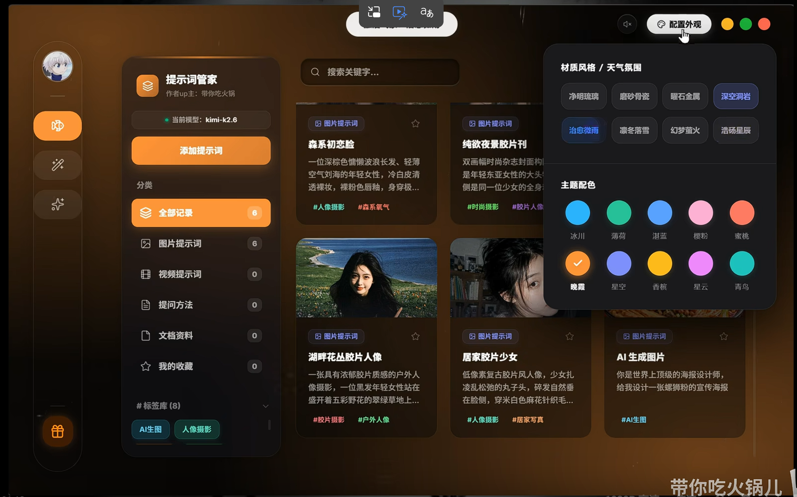

# 梦笔（mengbi）绘画工具箱

> 梦中之笔，绘未来之画 —— 一个不断进化的 AI 绘画工具箱。

---

## 项目简介

**梦笔** 是一个基于 **Electron** 的跨平台桌面应用，聚合多种 AI 绘画模型与大语言模型，提供从提示词优化、参考图编辑到批量生成、图库管理与提示词反推的一站式创作流。

- ✨ 三模块：**生图 / 提示词管家（含图库） / 实验室**
- 🎨 二维主题：7 种"材质氛围" × 10 种"主题配色"= 70 种组合
- 🔐 本地优先：API Key 走系统 `safeStorage` 加密，所有外网请求由主进程发出
- 📦 三平台：Windows / macOS / Linux 一致体验
- 🤖 AI 辅助开发：本仓库由 Claude Code 依据 [`CLAUDE.md`](./CLAUDE.md) 协助实现

---

## 设计预览

> 设计稿位于 `前端页面设计参考/`：

| 模块 | 预览 |
|------|------|
| 生图 |  |
| 提示词管家 |  |
| 主题切换 |  |

---

## 技术栈

| 层级 | 技术 |
|------|------|
| 桌面容器 | Electron 28+ |
| 前端 | React 18 + TypeScript + Vite 5 |
| 状态管理 | Zustand |
| 动效 | Framer Motion |
| 主进程 | Node.js（Electron Main） |
| 数据库 | better-sqlite3（同步） |
| 安全 | Electron `safeStorage` |
| 打包 | electron-builder |
| 更新 | electron-updater |

---

## 快速开始

> 前置要求详见 [`ENVIRONMENT.md`](./ENVIRONMENT.md)。

```bash
# 1. 克隆仓库
git clone <repo-url>
cd mengbi

# 2. 安装依赖（postinstall 会自动 electron-rebuild）
npm install

# 3. 启动开发模式
npm run dev
```

### 常用脚本

```bash
npm run dev           # Vite + Electron 开发模式
npm run typecheck     # tsc --noEmit
npm run lint          # ESLint
npm run build         # Vite 产物
npm run package:win   # electron-builder --win
npm run package:mac   # electron-builder --mac
npm run package:linux # electron-builder --linux
```

> 开发阶段如果在 Linux 没有 keyring backend，可设置 `MENGBI_DEV_KEY=<32 位十六进制>` 走 safeStorage 兜底。

---

## 项目结构

```
mengbi/
├── electron/
│   ├── main.ts            # Electron 主进程入口
│   ├── preload.ts         # contextBridge 白名单
│   └── ipc/               # IPC 路由
│       ├── index.ts
│       ├── chat.ts        # 对话相关
│       ├── generate.ts    # 绘图相关
│       ├── gallery.ts     # 图库 / 提示词管家
│       ├── settings.ts    # 方案 / 模型配置 / 测试连通
│       └── lab.ts         # 实验室
├── src/
│   ├── assets/
│   ├── components/        # 通用组件
│   ├── pages/
│   │   ├── Create/        # 生图 (`/`)
│   │   ├── Manager/       # 提示词管家 + 图库 (`/manager`)
│   │   └── Laboratory/    # 实验室 (`/lab`)
│   ├── store/             # Zustand stores
│   ├── hooks/
│   ├── styles/
│   │   └── theme.css      # 7 + 10 套主题 token
│   └── App.tsx
├── resources/             # 应用图标、托盘图等
├── 前端页面设计参考/       # 设计稿
├── package.json
├── electron-builder.yml
├── tsconfig.json
└── vite.config.ts
```

---

## 文档地图

| 文档 | 用途 |
|------|------|
| [`WHITEPAPER.md`](./WHITEPAPER.md) | 产品视角的项目说明书：用户故事、竞品差异、Roadmap |
| [`FEATURES.md`](./FEATURES.md) | P0 / P1 / P2 优先级功能清单 |
| [`ARCHITECTURE.md`](./ARCHITECTURE.md) | 技术架构、模块依赖、流式时序图 |
| [`DEVELOPMENT.md`](./DEVELOPMENT.md) | 7 个 Phase 的开发节奏与验收标准 |
| [`ENVIRONMENT.md`](./ENVIRONMENT.md) | 开发 / 用户 / API 服务环境要求 |
| [`THEMING.md`](./THEMING.md) | 7 × 10 主题矩阵与 CSS 变量规则 |
| [`CLAUDE.md`](./CLAUDE.md) | AI 开发指令（Claude Code 据此生成代码，最权威） |

> **没有** `SETUP.md` —— 安装信息已合并到本文件的「快速开始」与 `ENVIRONMENT.md`。

---

## 开发方式

本项目使用 **Claude Code** 进行 AI 辅助开发：

1. 所有代码生成都遵循 [`CLAUDE.md`](./CLAUDE.md) 中的目录结构、IPC 通道命名、数据模型与设计规范；
2. 阶段排期与验收标准见 [`DEVELOPMENT.md`](./DEVELOPMENT.md)；
3. 关键决策（主题、导航、视频提示词范围、Slogan）已在文档中固化，避免漂移。

---

## License

本项目采用 **MIT License**。

```
Copyright (c) 2026 mengbi contributors

Permission is hereby granted, free of charge, to any person obtaining a copy
of this software and associated documentation files (the "Software"), to deal
in the Software without restriction, including without limitation the rights
to use, copy, modify, merge, publish, distribute, sublicense, and/or sell
copies of the Software, and subject to the following conditions:

The above copyright notice and this permission notice shall be included in all
copies or substantial portions of the Software.

THE SOFTWARE IS PROVIDED "AS IS", WITHOUT WARRANTY OF ANY KIND, EXPRESS OR
IMPLIED, INCLUDING BUT NOT LIMITED TO THE WARRANTIES OF MERCHANTABILITY,
FITNESS FOR A PARTICULAR PURPOSE AND NONINFRINGEMENT.
```

> 完整许可证全文将在 Phase 1 落地后写入仓库根目录的 `LICENSE` 文件（本轮文档阶段不创建）。

---

## 致谢

- Electron / React / Vite 社区
- 各家提供 OpenAI 兼容协议的中转站
- 测试与试用本工具的早期用户
